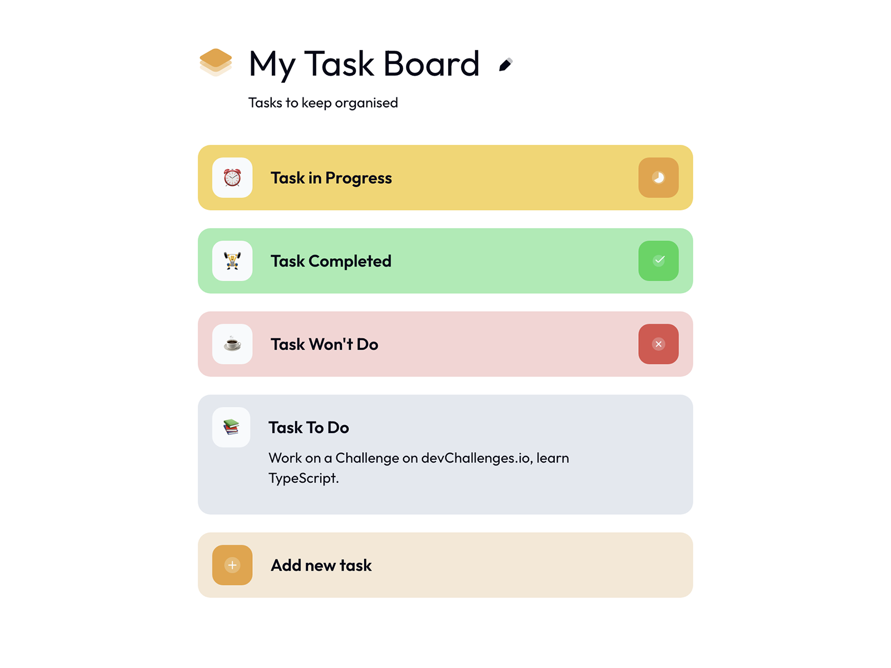

# My Task Board

This is a solution to the My Task Board on [devChallenges.io](https://devchallenges.io).

## Table of contents

- [Overview](#overview)
  - [Screenshot](#screenshot)
  - [Links](#links)
- [My process](#my-process)
  - [Built with](#built-with)
  - [What I learned](#what-i-learned)
- [Credits](#credits)

## Overview

### Screenshot

This is a screenshot of the final view of the project.

### Links

- Solution URL: [https://github.com/thejxylog/my-task-board-react](https://github.com/thejxylog/my-task-board-react)
- Live Site URL: [https://my-task-board-react-jayl.vercel.app/](https://my-task-board-react-jayl.vercel.app)

## My process

### Built with

- React.js
- Styled components
- React Router Dom
- React Hook Form

### What I learned

Instead of using external databases such as Supabase, Firebase and etc., I learned how to manipulate local storage data even further and revisited validating form data with Reack Hook Form library. I've managed to give the users their unique ID also by using the local stoarge. The most trickiest part was parsing and stringifying task data when printing, and storing. It was a bit confusing at first time. I will also give it another shot by using Supabase later.

## Credits

- Challenge site - [devChallenge.io](https://devchallenges.io/challenge/my-task-board-appd)
- Author - [Thu Nghiem](https://devchallenges.io/profile/ff6a2335-b279-4601-8927-85c85af7e7d8)
